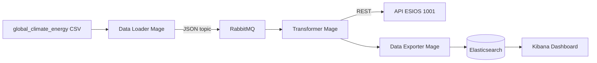

# EXPORT COMPLETO — Pipeline IoT Clima-Energía (para otra IA)

## CONTEXTO DEL PROYECTO

**Objetivo:** Pipeline de datos IoT que simula captura de sensores desde CSV, procesa en tiempo real con Mage.ai + RabbitMQ, enriquece con API ESIOS (indicador 1001 PVPC) y persiste en Elasticsearch (local/Azure) con visualización Kibana.

**Ubicación original:** `C:\Users\Deusto\.cursor\projects\C-Users-Deusto-AppData-Local-Temp-c62842ef-5cbd-4a20-9d26-cfbce26dda19\iot-climate-pipeline`

**Stack:** Mage.ai, RabbitMQ (topic), Pandas, pika, requests, elasticsearch-py, Docker Compose, Azure CLI + Elastic Cloud.

**Flujo:**
1. Data Loader lee `global_climate_energy_2020_2024.csv` fila a fila cada 10s → publica JSON en RabbitMQ
2. Transformer consume cola → limpia outliers → llama ESIOS → calcula `potential_savings` y alertas
3. Data Exporter indexa en Elasticsearch con mapping explícito

**Variables CSV:** date, country, avg_temperature, humidity, co2_emission, energy_consumption, renewable_share, urban_population, industrial_activity_index, energy_price

---

## ESTRUCTURA DE ARCHIVOS

```
iot-climate-pipeline/
├── data/global_climate_energy_2020_2024.csv  (200 filas ejemplo)
├── climate_mage/
│   ├── data_loaders/sensor_capture_producer.py
│   ├── transformers/esios_enrichment_consumer.py
│   ├── data_exporters/elasticsearch_exporter.py
│   ├── pipelines/climate_iot_pipeline/metadata.yaml
│   └── utils/ (field_mapping, rabbitmq_client, esios_client, data_cleaning, elasticsearch_client)
├── docker-compose.yml
├── docker-compose.azure.yml
├── .env.example
├── requirements.txt
├── config/elasticsearch_mapping.json
├── scripts/ (setup_elasticsearch_index.py, azure_deploy_elasticsearch.ps1)
└── kibana/KIBANA_DASHBOARD.md
```

---

## INSTRUCCIONES DE USO

```powershell
cd iot-climate-pipeline
copy .env.example .env
# Editar ESIOS_API_KEY
docker compose --env-file .env up -d
python scripts/setup_elasticsearch_index.py
# Mage: http://localhost:6789 → pipeline climate_iot_pipeline
```

---

## ARCHIVO: requirements.txt

```
pandas>=2.0.0
pika>=1.3.0
requests>=2.31.0
elasticsearch>=8.12.0
python-dotenv>=1.0.0
```

---

## ARCHIVO: .env.example

```
RABBITMQ_HOST=rabbitmq
RABBITMQ_PORT=5672
RABBITMQ_USER=guest
RABBITMQ_PASSWORD=guest
RABBITMQ_EXCHANGE=climate.iot
RABBITMQ_QUEUE=climate.sensor.records
RABBITMQ_ROUTING_KEY=sensor.record
SENSOR_CAPTURE_INTERVAL_SECONDS=10
SENSOR_MAX_ROWS=5
CSV_SOURCE_PATH=/home/src/data/global_climate_energy_2020_2024.csv
ESIOS_API_URL=https://api.esios.ree.es
ESIOS_API_KEY=tu_token_esios_aqui
ESIOS_INDICATOR_ID=1001
ELASTICSEARCH_HOSTS=http://elasticsearch:9200
ELASTICSEARCH_INDEX=climate_energy_iot
ELASTICSEARCH_USER=elastic
ELASTICSEARCH_PASSWORD=changeme
```

---

## ARCHIVO: docker-compose.yml

Ver sección completa en el repositorio — servicios: rabbitmq (5672, 15672), elasticsearch (9200), kibana (5601), mage (6789).

---

## ARCHIVO: climate_mage/utils/field_mapping.py

```python
RECORD_FIELD_MAPPING = {
    "date": "date", "country": "keyword",
    "avg_temperature": "float", "humidity": "float",
    "co2_emission": "float", "energy_consumption": "float",
    "renewable_share": "float", "urban_population": "float",
    "industrial_activity_index": "float", "energy_price": "float",
}
ENRICHED_FIELD_MAPPING = {**RECORD_FIELD_MAPPING,
    "pvpc_esios": "float", "potential_savings": "float",
    "esios_timestamp": "date", "alert_high_consumption_price": "boolean",
}
def coerce_record(raw): ...  # convierte tipos según mapping
def elasticsearch_index_mapping(): ...  # genera mappings ES
```

---

## ARCHIVO: climate_mage/data_loaders/sensor_capture_producer.py

- Decorador `@data_loader` de Mage.ai
- Lee CSV con pandas
- `coerce_record()` por fila
- `publish_record()` a RabbitMQ topic `climate.iot` / `sensor.record`
- `time.sleep(interval)` default 10s
- Retorna DataFrame resumen con published/errors

---

## ARCHIVO: climate_mage/transformers/esios_enrichment_consumer.py

- Decorador `@transformer`
- `drain_queue_to_list()` consume mensajes RabbitMQ
- `clean_sensor_dataframe()`: dropna, temp -40..60, humidity 0..100
- `fetch_pvpc_for_timestamp(date)` API GET `/indicators/1001`
- `enrich_record()`: potential_savings, alert_high_consumption_price (P90 consumo + PVPC alto)
- Retorna DataFrame enriquecido

---

## ARCHIVO: climate_mage/data_exporters/elasticsearch_exporter.py

- Decorador `@data_exporter`
- EXPORT_FIELD_MAPPING explícito: date→date, energy_consumption→float
- `bulk_index_documents()` a índice `climate_energy_iot`

---

## API ESIOS

- URL: `https://api.esios.ree.es/indicators/1001`
- Header: `x-api-key: TOKEN`
- Params: start_date, end_date, time_trunc=hour
- Conversión: €/MWh → €/kWh (/1000)
- potential_savings = max(0, energy_price - pvpc) * energy_consumption

---

## KIBANA (3 visualizaciones)

1. Line chart: energy_consumption vs pvpc_esios por date
2. Heatmap: co2_emission por industrial_activity_index x country
3. Alertas: count donde alert_high_consumption_price=true

---

## MEJORAS / RETOS / ALTERNATIVAS

- Mage secuencial vs streaming real → usar procesos separados
- ESIOS 1001 vs 600 (PVPC oficial)
- Alternativas: Kafka, Airflow, Grafana, Cosmos DB

---

## NOTA CSV

El archivo `data/global_climate_energy_2020_2024.csv` tiene 200 filas generadas de ejemplo.
Columnas: date,country,avg_temperature,humidity,co2_emission,energy_consumption,renewable_share,urban_population,industrial_activity_index,energy_price

Primeras filas:
```
2020-01-01,Spain,20.58,21.88,4.75,11937.33,61.55,5736896.0,1.103,0.1035
2020-01-02,France,11.88,22.23,4.186,25762.41,11.86,2391864.0,0.885,0.2271
...
```

---

## CÓDIGO FUENTE COMPLETO

A continuación el código íntegro de cada módulo Python (copiar para recrear el proyecto).


---
# CODIGO COMPLETO POR ARCHIVO


## FILE: docker-compose.yml
```
# Despliegue LOCAL: Mage.ai + RabbitMQ + Elasticsearch + Kibana
services:
  rabbitmq:
    image: rabbitmq:3.13-management
    container_name: iot-rabbitmq
    ports:
      - "5672:5672"
      - "15672:15672"
    environment:
      RABBITMQ_DEFAULT_USER: ${RABBITMQ_USER:-guest}
      RABBITMQ_DEFAULT_PASS: ${RABBITMQ_PASSWORD:-guest}
    volumes:
      - rabbitmq_data:/var/lib/rabbitmq
    healthcheck:
      test: ["CMD", "rabbitmq-diagnostics", "-q", "ping"]
      interval: 10s
      timeout: 5s
      retries: 5
    networks:
      - iot-net

  elasticsearch:
    image: docker.elastic.co/elasticsearch/elasticsearch:8.12.2
    container_name: iot-elasticsearch
    environment:
      - discovery.type=single-node
      - xpack.security.enabled=true
      - xpack.security.http.ssl.enabled=false
      - ELASTIC_PASSWORD=${ELASTICSEARCH_PASSWORD:-changeme}
      - ES_JAVA_OPTS=-Xms512m -Xmx512m
    ports:
      - "9200:9200"
    volumes:
      - es_data:/usr/share/elasticsearch/data
    healthcheck:
      test:
        [
          "CMD-SHELL",
          "curl -s -u elastic:${ELASTICSEARCH_PASSWORD:-changeme} http://localhost:9200/_cluster/health | grep -q green\\|yellow",
        ]
      interval: 15s
      timeout: 10s
      retries: 10
    networks:
      - iot-net

  kibana:
    image: docker.elastic.co/kibana/kibana:8.12.2
    container_name: iot-kibana
    depends_on:
      elasticsearch:
        condition: service_healthy
    ports:
      - "5601:5601"
    environment:
      - ELASTICSEARCH_HOSTS=http://elasticsearch:9200
      - ELASTICSEARCH_USERNAME=elastic
      - ELASTICSEARCH_PASSWORD=${ELASTICSEARCH_PASSWORD:-changeme}
    networks:
      - iot-net

  mage:
    image: mageai/mageai:latest
    container_name: iot-mage
    depends_on:
      rabbitmq:
        condition: service_healthy
      elasticsearch:
        condition: service_healthy
    ports:
      - "6789:6789"
    env_file:
      - .env
    environment:
      - PYTHONPATH=/home/src
      - MAGE_DATA_DIR=/home/src/mage_data
    volumes:
      - ./climate_mage:/home/src/climate_mage
      - ./data:/home/src/data
      - ./climate_mage/requirements.txt:/home/src/requirements.txt
      - mage_data:/home/src/mage_data
    working_dir: /home/src
    command: >
      bash -c "pip install -q -r /home/src/requirements.txt &&
               mage start climate_mage --host 0.0.0.0 --port 6789"
    networks:
      - iot-net

volumes:
  rabbitmq_data:
  es_data:
  mage_data:

networks:
  iot-net:
    driver: bridge

```

## FILE: docker-compose.azure.yml
```
# Despliegue AZURE: Mage.ai + RabbitMQ conectados a Elasticsearch en Elastic Cloud
# Uso: docker compose -f docker-compose.azure.yml --env-file .env up -d
services:
  rabbitmq:
    image: rabbitmq:3.13-management
    container_name: iot-rabbitmq-azure
    ports:
      - "5672:5672"
      - "15672:15672"
    environment:
      RABBITMQ_DEFAULT_USER: ${RABBITMQ_USER:-guest}
      RABBITMQ_DEFAULT_PASS: ${RABBITMQ_PASSWORD:-guest}
    volumes:
      - rabbitmq_data_azure:/var/lib/rabbitmq
    healthcheck:
      test: ["CMD", "rabbitmq-diagnostics", "-q", "ping"]
      interval: 10s
      timeout: 5s
      retries: 5
    networks:
      - iot-azure-net

  mage:
    image: mageai/mageai:latest
    container_name: iot-mage-azure
    depends_on:
      rabbitmq:
        condition: service_healthy
    ports:
      - "6789:6789"
    env_file:
      - .env
    environment:
      - PYTHONPATH=/home/src
      - MAGE_DATA_DIR=/home/src/mage_data
      # Elasticsearch en Azure (Elastic Cloud) — configurar en .env
      - ELASTICSEARCH_CLOUD_ID=${ELASTICSEARCH_CLOUD_ID}
      - ELASTICSEARCH_API_KEY=${ELASTICSEARCH_API_KEY}
      - ELASTICSEARCH_HOSTS=${ELASTICSEARCH_HOSTS}
      - ELASTICSEARCH_INDEX=${ELASTICSEARCH_INDEX:-climate_energy_iot}
    volumes:
      - ./climate_mage:/home/src/climate_mage
      - ./data:/home/src/data
      - ./climate_mage/requirements.txt:/home/src/requirements.txt
      - mage_data_azure:/home/src/mage_data
    working_dir: /home/src
    command: >
      bash -c "pip install -q -r /home/src/requirements.txt &&
               mage start climate_mage --host 0.0.0.0 --port 6789"
    networks:
      - iot-azure-net

volumes:
  rabbitmq_data_azure:
  mage_data_azure:

networks:
  iot-azure-net:
    driver: bridge

```

## FILE: .env.example
```
# --- RabbitMQ ---
RABBITMQ_HOST=rabbitmq
RABBITMQ_PORT=5672
RABBITMQ_USER=guest
RABBITMQ_PASSWORD=guest
RABBITMQ_VHOST=/
RABBITMQ_EXCHANGE=climate.iot
RABBITMQ_QUEUE=climate.sensor.records
RABBITMQ_ROUTING_KEY=sensor.record
RABBITMQ_CONSUME_TIMEOUT_SECONDS=120

# --- Simulación IoT ---
CSV_SOURCE_PATH=/home/src/data/global_climate_energy_2020_2024.csv
SENSOR_CAPTURE_INTERVAL_SECONDS=10
SENSOR_MAX_ROWS=5

# --- API ESIOS (solicitar token en https://www.esios.ree.es/es/pagina/api) ---
ESIOS_API_URL=https://api.esios.ree.es
ESIOS_API_KEY=tu_token_esios_aqui
ESIOS_INDICATOR_ID=1001

# --- Elasticsearch LOCAL ---
ELASTICSEARCH_HOSTS=http://elasticsearch:9200
ELASTICSEARCH_INDEX=climate_energy_iot
ELASTICSEARCH_USER=elastic
ELASTICSEARCH_PASSWORD=changeme

# --- Elasticsearch AZURE (Elastic Cloud) ---
# ELASTICSEARCH_CLOUD_ID=tu_deployment:base64...
# ELASTICSEARCH_API_KEY=tu_api_key
# ELASTICSEARCH_HOSTS=https://tu-cluster.es.westeurope.azure.elastic-cloud.com

# --- Kibana ---
KIBANA_URL=http://localhost:5601

```

## FILE: requirements.txt
```
pandas>=2.0.0
pika>=1.3.0
requests>=2.31.0
elasticsearch>=8.12.0
python-dotenv>=1.0.0

```

## FILE: config\elasticsearch_mapping.json
```
{
  "mappings": {
    "properties": {
      "date": {
        "type": "date",
        "format": "strict_date_optional_time||yyyy-MM-dd"
      },
      "country": { "type": "keyword" },
      "avg_temperature": { "type": "float" },
      "humidity": { "type": "float" },
      "co2_emission": { "type": "float" },
      "energy_consumption": { "type": "float" },
      "renewable_share": { "type": "float" },
      "urban_population": { "type": "float" },
      "industrial_activity_index": { "type": "float" },
      "energy_price": { "type": "float" },
      "pvpc_esios": { "type": "float" },
      "potential_savings": { "type": "float" },
      "esios_timestamp": {
        "type": "date",
        "format": "strict_date_optional_time||epoch_millis"
      },
      "alert_high_consumption_price": { "type": "boolean" }
    }
  }
}

```

## FILE: climate_mage\pipelines\climate_iot_pipeline\metadata.yaml
```
blocks:
  - all_upstream_blocks_executed: true
    color: null
    configuration: {}
    downstream_blocks:
      - esios_enrichment_consumer
    executor_config: null
    executor_type: local_python
    has_callback: false
    language: python
    name: sensor_capture_producer
    retry_config: null
    status: not_executed
    timeout: null
    type: data_loader
    upstream_blocks: []
    uuid: sensor_capture_producer
  - all_upstream_blocks_executed: true
    color: null
    configuration: {}
    downstream_blocks:
      - elasticsearch_exporter
    executor_config: null
    executor_type: local_python
    has_callback: false
    language: python
    name: esios_enrichment_consumer
    retry_config: null
    status: not_executed
    timeout: null
    type: transformer
    upstream_blocks:
      - sensor_capture_producer
    uuid: esios_enrichment_consumer
  - all_upstream_blocks_executed: true
    color: null
    configuration: {}
    downstream_blocks: []
    executor_config: null
    executor_type: local_python
    has_callback: false
    language: python
    name: elasticsearch_exporter
    retry_config: null
    status: not_executed
    timeout: null
    type: data_exporter
    upstream_blocks:
      - esios_enrichment_consumer
    uuid: elasticsearch_exporter
cache_block_output_in_memory: false
callbacks: []
concurrency_config: {}
conditionals: []
created_at: null
data_integration: null
description: Pipeline IoT clima-energía con RabbitMQ, ESIOS y Elasticsearch
executor_config: {}
executor_count: 1
executor_type: null
extensions: {}
name: climate_iot_pipeline
notification_config: {}
remote_variables_dir: null
retry_config: {}
run_pipeline_in_one_process: false
settings:
  triggers: null
spark_config: {}
state_store_config: {}
tags:
  - iot
  - rabbitmq
  - esios
type: python
uuid: climate_iot_pipeline
variables_dir: null
widgets: []

```

## FILE: climate_mage\data_loaders\sensor_capture_producer.py
```
"""
Bloque Data Loader (Productor): simula captura IoT leyendo el CSV
fila a fila cada N segundos y publica JSON en RabbitMQ (topic exchange).
"""

import os
import sys
import time
from pathlib import Path

import pandas as pd

if "data_loader" not in globals():
    from mage_ai.data_preparation.decorators import data_loader
if "test" not in globals():
    from mage_ai.data_preparation.decorators import test

# Añadir raíz del proyecto Mage al path
_PROJECT_ROOT = Path(__file__).resolve().parents[1]
if str(_PROJECT_ROOT.parent) not in sys.path:
    sys.path.insert(0, str(_PROJECT_ROOT.parent))

from climate_mage.utils.field_mapping import RECORD_FIELD_MAPPING, coerce_record
from climate_mage.utils.rabbitmq_client import publish_record


@data_loader
def load_and_publish_to_rabbitmq(*args, **kwargs) -> pd.DataFrame:
    """
    Lee global_climate_energy_2020_2024.csv y publica cada fila en RabbitMQ.
    Devuelve un resumen de la captura para el bloque downstream.
    """
    csv_path = os.getenv(
        "CSV_SOURCE_PATH",
        "/home/src/data/global_climate_energy_2020_2024.csv",
    )
    interval = int(os.getenv("SENSOR_CAPTURE_INTERVAL_SECONDS", "10"))
    max_rows = int(os.getenv("SENSOR_MAX_ROWS", "0"))  # 0 = todas las filas

    published = 0
    errors = 0
    preview_rows = []

    try:
        df = pd.read_csv(csv_path)
    except FileNotFoundError as exc:
        raise FileNotFoundError(f"CSV no encontrado en {csv_path}") from exc

    columns = list(RECORD_FIELD_MAPPING.keys())
    missing = [c for c in columns if c not in df.columns]
    if missing:
        raise ValueError(f"Columnas faltantes en CSV: {missing}")

    for idx, row in df.iterrows():
        if max_rows and published >= max_rows:
            break

        raw = row[columns].to_dict()
        record = coerce_record(raw)

        try:
            publish_record(record)
            published += 1
            if len(preview_rows) < 5:
                preview_rows.append(record)
            print(
                f"[Captura] Publicado registro {published}: "
                f"{record['date']} | {record['country']} | "
                f"energy_consumption={record['energy_consumption']}"
            )
        except ConnectionError as exc:
            errors += 1
            print(f"[Captura] Error RabbitMQ fila {idx}: {exc}")

        time.sleep(interval)

    summary = pd.DataFrame(
        [
            {
                "status": "completed",
                "published": published,
                "errors": errors,
                "interval_seconds": interval,
                "mapping": str(RECORD_FIELD_MAPPING),
            }
        ]
    )
    return summary


@test
def test_output(output, *args) -> None:
    assert output is not None
    assert "published" in output.columns

```

## FILE: climate_mage\transformers\esios_enrichment_consumer.py
```
"""
Bloque Transformer (Suscriptor): consume RabbitMQ, limpia con Pandas,
consulta ESIOS (PVPC 1001) y calcula potential_savings.
"""

import os
import sys
from pathlib import Path

import pandas as pd

if "transformer" not in globals():
    from mage_ai.data_preparation.decorators import transformer
if "test" not in globals():
    from mage_ai.data_preparation.decorators import test

_PROJECT_ROOT = Path(__file__).resolve().parents[1]
if str(_PROJECT_ROOT.parent) not in sys.path:
    sys.path.insert(0, str(_PROJECT_ROOT.parent))

from climate_mage.utils.data_cleaning import clean_sensor_dataframe, enrich_record
from climate_mage.utils.esios_client import fetch_pvpc_for_timestamp
from climate_mage.utils.rabbitmq_client import drain_queue_to_list


@transformer
def transform(data, *args, **kwargs) -> pd.DataFrame:
    """
    Escucha la cola RabbitMQ, limpia outliers/nulos y enriquece con ESIOS.
    """
    timeout = int(os.getenv("RABBITMQ_CONSUME_TIMEOUT_SECONDS", "120"))

    try:
        raw_records = drain_queue_to_list(timeout_seconds=timeout)
    except ConnectionError as exc:
        print(f"[Transformer] Error RabbitMQ: {exc}")
        return pd.DataFrame()

    if not raw_records:
        print("[Transformer] Cola vacía — ejecute primero el Data Loader.")
        return pd.DataFrame()

    df = pd.DataFrame(raw_records)
    df_clean = clean_sensor_dataframe(df)

    if df_clean.empty:
        print("[Transformer] Sin registros tras limpieza.")
        return df_clean

    p90 = float(df_clean["energy_consumption"].quantile(0.90))
    enriched_rows = []

    for _, row in df_clean.iterrows():
        record = row.to_dict()
        try:
            pvpc_data = fetch_pvpc_for_timestamp(str(record["date"]))
        except Exception as exc:  # noqa: BLE001 — registro no debe romper el lote
            pvpc_data = {"pvpc_esios": None, "esios_error": str(exc)}

        enriched = enrich_record(record, pvpc_data, p90)
        enriched_rows.append(enriched)

    result = pd.DataFrame(enriched_rows)
    print(f"[Transformer] Procesados {len(result)} registros enriquecidos.")
    return result


@test
def test_output(output, *args) -> None:
    assert output is not None

```

## FILE: climate_mage\data_exporters\elasticsearch_exporter.py
```
"""
Bloque Data Exporter: persiste JSON enriquecido en Elasticsearch (Azure/local).
Incluye mapping explícito (date → date, energy_consumption → float).
"""

import os
import sys
from pathlib import Path

import pandas as pd

if "data_exporter" not in globals():
    from mage_ai.data_preparation.decorators import data_exporter
if "test" not in globals():
    from mage_ai.data_preparation.decorators import test

_PROJECT_ROOT = Path(__file__).resolve().parents[1]
if str(_PROJECT_ROOT.parent) not in sys.path:
    sys.path.insert(0, str(_PROJECT_ROOT.parent))

from climate_mage.utils.elasticsearch_client import bulk_index_documents
from climate_mage.utils.field_mapping import ENRICHED_FIELD_MAPPING, coerce_record


# Mapping explícito requerido en el exporter
EXPORT_FIELD_MAPPING = {
    "date": "date",
    "energy_consumption": "float",
    **{k: v for k, v in ENRICHED_FIELD_MAPPING.items() if k not in ("date", "energy_consumption")},
}


def _apply_export_mapping(record: dict) -> dict:
    mapped = coerce_record(record)
    for key in ("pvpc_esios", "potential_savings", "renewable_share", "co2_emission"):
        if key in record and record[key] is not None:
            try:
                mapped[key] = float(record[key])
            except (TypeError, ValueError):
                mapped[key] = None
    if "alert_high_consumption_price" in record:
        mapped["alert_high_consumption_price"] = bool(record["alert_high_consumption_price"])
    if "esios_timestamp" in record:
        mapped["esios_timestamp"] = record.get("esios_timestamp")
    return mapped


@data_exporter
def export_to_elasticsearch(data: pd.DataFrame, *args, **kwargs) -> None:
    """Envía cada fila limpia/enriquecida a Elasticsearch."""
    if data is None or data.empty:
        print("[Exporter] Sin datos para exportar.")
        return

    documents = [_apply_export_mapping(row.to_dict()) for _, row in data.iterrows()]

    try:
        stats = bulk_index_documents(documents)
        print(
            f"[Exporter] Mapping aplicado: {EXPORT_FIELD_MAPPING} | "
            f"Indexados: {stats['indexed']} | Errores: {stats['errors']}"
        )
    except ConnectionError as exc:
        print(f"[Exporter] Error conexión Elasticsearch/Azure: {exc}")
        raise


@test
def test_output(*args) -> None:
    pass

```

## FILE: climate_mage\utils\field_mapping.py
```
"""Mapeo explícito de campos para serialización JSON y Elasticsearch."""

from datetime import datetime
from typing import Any

# Mapping explícito: tipos lógicos por campo
RECORD_FIELD_MAPPING = {
    "date": "date",
    "country": "keyword",
    "avg_temperature": "float",
    "humidity": "float",
    "co2_emission": "float",
    "energy_consumption": "float",
    "renewable_share": "float",
    "urban_population": "float",
    "industrial_activity_index": "float",
    "energy_price": "float",
}

ENRICHED_FIELD_MAPPING = {
    **RECORD_FIELD_MAPPING,
    "pvpc_esios": "float",
    "potential_savings": "float",
    "esios_timestamp": "date",
    "alert_high_consumption_price": "boolean",
}


def coerce_record(raw: dict[str, Any]) -> dict[str, Any]:
    """Aplica el mapping de tipos al registro de sensor."""
    record: dict[str, Any] = {}
    for field, field_type in RECORD_FIELD_MAPPING.items():
        value = raw.get(field)
        if value is None or (isinstance(value, float) and value != value):
            record[field] = None
            continue
        if field_type == "date":
            if isinstance(value, datetime):
                record[field] = value.date().isoformat()
            else:
                record[field] = str(value)[:10]
        elif field_type == "keyword":
            record[field] = str(value)
        elif field_type == "float":
            record[field] = float(value)
        else:
            record[field] = value
    return record


def elasticsearch_index_mapping() -> dict:
    """Mapping del índice Elasticsearch."""
    properties = {}
    for field, field_type in ENRICHED_FIELD_MAPPING.items():
        if field_type == "date":
            properties[field] = {"type": "date", "format": "strict_date_optional_time||yyyy-MM-dd"}
        elif field_type == "keyword":
            properties[field] = {"type": "keyword"}
        elif field_type == "boolean":
            properties[field] = {"type": "boolean"}
        else:
            properties[field] = {"type": "float"}
    return {"mappings": {"properties": properties}}

```

## FILE: climate_mage\utils\rabbitmq_client.py
```
"""Cliente RabbitMQ (topic exchange) con pika."""

import json
import os
from typing import Any, Callable, Optional

import pika
from pika.adapters.blocking_connection import BlockingChannel
from pika.spec import Basic, BasicProperties

DEFAULT_EXCHANGE = os.getenv("RABBITMQ_EXCHANGE", "climate.iot")
DEFAULT_QUEUE = os.getenv("RABBITMQ_QUEUE", "climate.sensor.records")
DEFAULT_ROUTING_KEY = os.getenv("RABBITMQ_ROUTING_KEY", "sensor.record")


def _connection_params() -> pika.ConnectionParameters:
    return pika.ConnectionParameters(
        host=os.getenv("RABBITMQ_HOST", "rabbitmq"),
        port=int(os.getenv("RABBITMQ_PORT", "5672")),
        virtual_host=os.getenv("RABBITMQ_VHOST", "/"),
        credentials=pika.PlainCredentials(
            os.getenv("RABBITMQ_USER", "guest"),
            os.getenv("RABBITMQ_PASSWORD", "guest"),
        ),
        heartbeat=600,
        blocked_connection_timeout=300,
    )


def setup_topology(channel: BlockingChannel) -> None:
    """Declara exchange topic, cola durable y binding."""
    exchange = DEFAULT_EXCHANGE
    queue = DEFAULT_QUEUE
    routing_key = DEFAULT_ROUTING_KEY

    channel.exchange_declare(exchange=exchange, exchange_type="topic", durable=True)
    channel.queue_declare(queue=queue, durable=True)
    channel.queue_bind(exchange=exchange, queue=queue, routing_key=routing_key)


def publish_record(record: dict[str, Any], routing_key: Optional[str] = None) -> None:
    """Publica un registro JSON en el topic exchange."""
    routing_key = routing_key or DEFAULT_ROUTING_KEY
    try:
        connection = pika.BlockingConnection(_connection_params())
        channel = connection.channel()
        setup_topology(channel)
        channel.basic_publish(
            exchange=DEFAULT_EXCHANGE,
            routing_key=routing_key,
            body=json.dumps(record, default=str),
            properties=pika.BasicProperties(
                delivery_mode=2,
                content_type="application/json",
            ),
        )
        connection.close()
    except pika.exceptions.AMQPError as exc:
        raise ConnectionError(f"Error publicando en RabbitMQ: {exc}") from exc


def consume_records(
    callback: Callable[[dict[str, Any]], None],
    max_messages: Optional[int] = None,
    timeout_seconds: int = 30,
) -> int:
    """
    Consume mensajes de la cola y los pasa al callback.
    Devuelve el número de mensajes procesados.
    """
    processed = 0

    try:
        connection = pika.BlockingConnection(_connection_params())
        channel = connection.channel()
        setup_topology(channel)
        channel.basic_qos(prefetch_count=1)

        def on_message(
            ch: BlockingChannel,
            method: Basic.Deliver,
            _properties: BasicProperties,
            body: bytes,
        ) -> None:
            nonlocal processed
            try:
                payload = json.loads(body.decode("utf-8"))
                callback(payload)
                ch.basic_ack(delivery_tag=method.delivery_tag)
                processed += 1
                if max_messages and processed >= max_messages:
                    ch.stop_consuming()
            except (json.JSONDecodeError, ValueError) as exc:
                ch.basic_nack(delivery_tag=method.delivery_tag, requeue=False)
                print(f"Mensaje inválido descartado: {exc}")

        channel.basic_consume(queue=DEFAULT_QUEUE, on_message_callback=on_message, auto_ack=False)

        if max_messages:
            connection.process_data_events(time_limit=timeout_seconds)
            while processed < max_messages:
                connection.process_data_events(time_limit=1)
                if not channel.is_open:
                    break
        else:
            channel.start_consuming()

        if channel.is_open:
            channel.stop_consuming()
        connection.close()
    except pika.exceptions.AMQPError as exc:
        raise ConnectionError(f"Error consumiendo de RabbitMQ: {exc}") from exc

    return processed


def drain_queue_to_list(timeout_seconds: int = 120) -> list[dict[str, Any]]:
    """Vacía mensajes disponibles en la cola hasta timeout."""
    records: list[dict[str, Any]] = []
    idle_rounds = 0
    max_idle = 3

    try:
        connection = pika.BlockingConnection(_connection_params())
        channel = connection.channel()
        setup_topology(channel)

        while idle_rounds < max_idle:
            method, _properties, body = channel.basic_get(queue=DEFAULT_QUEUE, auto_ack=True)
            if method is None:
                idle_rounds += 1
                connection.sleep(1)
                continue
            idle_rounds = 0
            records.append(json.loads(body.decode("utf-8")))

        connection.close()
    except pika.exceptions.AMQPError as exc:
        raise ConnectionError(f"Error leyendo cola RabbitMQ: {exc}") from exc

    return records

```

## FILE: climate_mage\utils\esios_client.py
```
"""Cliente REST para la API ESIOS (indicador PVPC / 1001)."""

import os
from datetime import datetime, timedelta
from typing import Any, Optional

import requests

ESIOS_BASE_URL = os.getenv("ESIOS_API_URL", "https://api.esios.ree.es")
ESIOS_INDICATOR_ID = os.getenv("ESIOS_INDICATOR_ID", "1001")


def _headers() -> dict[str, str]:
    api_key = os.getenv("ESIOS_API_KEY", "")
    return {
        "Accept": "application/json; application/vnd.esios-api-v1+json",
        "Content-Type": "application/json",
        "x-api-key": api_key,
    }


def fetch_pvpc_for_timestamp(record_date: str) -> dict[str, Any]:
    """
    Obtiene el PVPC (indicador 1001) para la fecha del registro.
    Devuelve dict con pvpc_esios (€/kWh), esios_timestamp y raw_value.
    """
    api_key = os.getenv("ESIOS_API_KEY")
    if not api_key:
        return {
            "pvpc_esios": None,
            "esios_timestamp": None,
            "esios_error": "ESIOS_API_KEY no configurada",
        }

    try:
        day = datetime.strptime(str(record_date)[:10], "%Y-%m-%d")
    except ValueError:
        return {
            "pvpc_esios": None,
            "esios_timestamp": None,
            "esios_error": f"Fecha inválida: {record_date}",
        }

    start = day.replace(hour=0, minute=0, second=0)
    end = start + timedelta(days=1) - timedelta(seconds=1)

    url = f"{ESIOS_BASE_URL}/indicators/{ESIOS_INDICATOR_ID}"
    params = {
        "start_date": start.strftime("%Y-%m-%dT%H:%M:%S"),
        "end_date": end.strftime("%Y-%m-%dT%H:%M:%S"),
        "time_trunc": "hour",
    }

    try:
        response = requests.get(url, headers=_headers(), params=params, timeout=30)
        response.raise_for_status()
        payload = response.json()
    except requests.exceptions.Timeout:
        return {
            "pvpc_esios": None,
            "esios_timestamp": None,
            "esios_error": "Timeout en API ESIOS",
        }
    except requests.exceptions.HTTPError as exc:
        return {
            "pvpc_esios": None,
            "esios_timestamp": None,
            "esios_error": f"HTTP {exc.response.status_code}: {exc.response.text[:200]}",
        }
    except requests.exceptions.RequestException as exc:
        return {
            "pvpc_esios": None,
            "esios_timestamp": None,
            "esios_error": str(exc),
        }

    values = payload.get("indicator", {}).get("values", [])
    if not values:
        return {
            "pvpc_esios": None,
            "esios_timestamp": None,
            "esios_error": "Sin valores ESIOS para la fecha",
        }

    # Primer valor horario del día (precio en €/MWh → €/kWh)
    first = values[0]
    raw_mwh = float(first.get("value", 0))
    pvpc_kwh = round(raw_mwh / 1000.0, 6)
    ts = first.get("datetime") or first.get("datetime_utc")

    return {
        "pvpc_esios": pvpc_kwh,
        "esios_timestamp": ts,
        "esios_raw_eur_mwh": raw_mwh,
    }


def compute_potential_savings(energy_price: float, pvpc: Optional[float], consumption: float) -> float:
    """
    Ahorro potencial si el precio del CSV supera al PVPC de ESIOS.
    Unidades: (€/kWh diff) * kWh consumidos.
    """
    if pvpc is None:
        return 0.0
    diff = max(0.0, float(energy_price) - float(pvpc))
    return round(diff * float(consumption), 4)

```

## FILE: climate_mage\utils\data_cleaning.py
```
"""Limpieza y filtrado de outliers con Pandas."""

from typing import Any

import pandas as pd

REQUIRED_COLUMNS = [
    "date",
    "country",
    "avg_temperature",
    "humidity",
    "co2_emission",
    "energy_consumption",
    "renewable_share",
    "urban_population",
    "industrial_activity_index",
    "energy_price",
]


def clean_sensor_dataframe(df: pd.DataFrame) -> pd.DataFrame:
    """Elimina nulos y filtra outliers físicamente imposibles."""
    if df.empty:
        return df

    working = df.copy()
    for col in REQUIRED_COLUMNS:
        if col not in working.columns:
            working[col] = None

    working = working[REQUIRED_COLUMNS]
    working = working.dropna(how="any")

    working["avg_temperature"] = pd.to_numeric(working["avg_temperature"], errors="coerce")
    working["humidity"] = pd.to_numeric(working["humidity"], errors="coerce")
    working["energy_consumption"] = pd.to_numeric(working["energy_consumption"], errors="coerce")
    working["energy_price"] = pd.to_numeric(working["energy_price"], errors="coerce")

    mask = (
        (working["avg_temperature"] <= 60)
        & (working["avg_temperature"] >= -40)
        & (working["humidity"] >= 0)
        & (working["humidity"] <= 100)
    )
    return working.loc[mask].reset_index(drop=True)


def enrich_record(record: dict[str, Any], pvpc_data: dict[str, Any], p90_consumption: float) -> dict[str, Any]:
    """Añade campos de cruce ESIOS y alertas."""
    energy_price = float(record.get("energy_price", 0))
    consumption = float(record.get("energy_consumption", 0))
    pvpc = pvpc_data.get("pvpc_esios")

    enriched = {**record, **pvpc_data}
    enriched["potential_savings"] = (
        round(max(0.0, (energy_price - pvpc) * consumption), 4) if pvpc is not None else 0.0
    )

    high_price_threshold = float(pd.Series([pvpc or 0]).quantile(0.75)) if pvpc else 0.15
    enriched["alert_high_consumption_price"] = (
        consumption >= p90_consumption and pvpc is not None and pvpc >= high_price_threshold
    )

    if enriched["alert_high_consumption_price"]:
        print(
            f"[ALERTA] Consumo P90+ ({consumption}) con PVPC alto ({pvpc}) "
            f"— país={record.get('country')} fecha={record.get('date')}"
        )

    return enriched

```

## FILE: climate_mage\utils\elasticsearch_client.py
```
"""Cliente Elasticsearch para Azure o local."""

import os
from typing import Any, Iterable

from elasticsearch import Elasticsearch
from elasticsearch.exceptions import ApiError, ConnectionError as ESConnectionError

from climate_mage.utils.field_mapping import elasticsearch_index_mapping


def get_elasticsearch_client() -> Elasticsearch:
    """Crea cliente según variables de entorno."""
    hosts = os.getenv("ELASTICSEARCH_HOSTS", "http://elasticsearch:9200").split(",")
    user = os.getenv("ELASTICSEARCH_USER")
    password = os.getenv("ELASTICSEARCH_PASSWORD")
    api_key = os.getenv("ELASTICSEARCH_API_KEY")
    cloud_id = os.getenv("ELASTICSEARCH_CLOUD_ID")

    kwargs: dict[str, Any] = {"hosts": hosts, "request_timeout": 60}
    if cloud_id:
        kwargs = {"cloud_id": cloud_id, "request_timeout": 60}
    if api_key:
        kwargs["api_key"] = api_key
    elif user and password:
        kwargs["basic_auth"] = (user, password)

    return Elasticsearch(**kwargs)


def ensure_index(client: Elasticsearch, index_name: str) -> None:
    """Crea el índice con mapping si no existe."""
    try:
        if client.indices.exists(index=index_name):
            return
        client.indices.create(index=index_name, body=elasticsearch_index_mapping())
    except (ApiError, ESConnectionError) as exc:
        raise ConnectionError(f"No se pudo crear/verificar índice {index_name}: {exc}") from exc


def bulk_index_documents(
    documents: Iterable[dict[str, Any]],
    index_name: str | None = None,
) -> dict[str, int]:
    """Indexa documentos en Elasticsearch."""
    index_name = index_name or os.getenv("ELASTICSEARCH_INDEX", "climate_energy_iot")
    client = get_elasticsearch_client()

    try:
        ensure_index(client, index_name)
    except ConnectionError:
        raise

    success = 0
    errors = 0
    for doc in documents:
        doc_id = f"{doc.get('date')}_{doc.get('country')}_{doc.get('esios_timestamp', '')}"
        try:
            client.index(index=index_name, id=doc_id, document=doc)
            success += 1
        except (ApiError, ESConnectionError) as exc:
            errors += 1
            print(f"Error indexando documento {doc_id}: {exc}")

    return {"indexed": success, "errors": errors}

```

## FILE: scripts\setup_elasticsearch_index.py
```
#!/usr/bin/env python3
"""Crea el índice Elasticsearch con el mapping definido."""

import json
import os
import sys
from pathlib import Path

from dotenv import load_dotenv
from elasticsearch import Elasticsearch
from elasticsearch.exceptions import ApiError

ROOT = Path(__file__).resolve().parents[1]
load_dotenv(ROOT / ".env")

MAPPING_PATH = ROOT / "config" / "elasticsearch_mapping.json"
INDEX = os.getenv("ELASTICSEARCH_INDEX", "climate_energy_iot")


def main() -> int:
    hosts = os.getenv("ELASTICSEARCH_HOSTS", "http://localhost:9200").split(",")
    user = os.getenv("ELASTICSEARCH_USER", "elastic")
    password = os.getenv("ELASTICSEARCH_PASSWORD", "changeme")
    cloud_id = os.getenv("ELASTICSEARCH_CLOUD_ID")
    api_key = os.getenv("ELASTICSEARCH_API_KEY")

    if cloud_id and api_key:
        client = Elasticsearch(cloud_id=cloud_id, api_key=api_key)
    else:
        client = Elasticsearch(hosts=hosts, basic_auth=(user, password))

    mapping = json.loads(MAPPING_PATH.read_text(encoding="utf-8"))

    try:
        if client.indices.exists(index=INDEX):
            print(f"Índice '{INDEX}' ya existe.")
            return 0
        client.indices.create(index=INDEX, body=mapping)
        print(f"Índice '{INDEX}' creado correctamente.")
        return 0
    except ApiError as exc:
        print(f"Error: {exc}", file=sys.stderr)
        return 1


if __name__ == "__main__":
    raise SystemExit(main())

```

## FILE: scripts\azure_deploy_elasticsearch.ps1
```
# Despliegue Elasticsearch en Azure (Elastic Cloud / Microsoft.Elastic)
# Ejecutar: .\scripts\azure_deploy_elasticsearch.ps1

$ErrorActionPreference = "Stop"

$ResourceGroup = if ($env:RESOURCE_GROUP) { $env:RESOURCE_GROUP } else { "rg-iot-climate" }
$Location = if ($env:LOCATION) { $env:LOCATION } else { "westeurope" }
$DeploymentName = if ($env:DEPLOYMENT_NAME) { $env:DEPLOYMENT_NAME } else { "iot-climate-es" }

Write-Host "==> Crear grupo de recursos"
az group create --name $ResourceGroup --location $Location

Write-Host "==> Registrar proveedor Microsoft.Elastic"
az provider register --namespace Microsoft.Elastic --wait

Write-Host "==> Crear monitor Elastic en Azure"
az elastic monitor create `
  --name $DeploymentName `
  --resource-group $ResourceGroup `
  --location $Location `
  --sku name="standard" tier="standard" `
  --user-info firstName="IoT" lastName="Pipeline" emailAddress="admin@example.com" `
  --generate-api-key

Write-Host "==> Detalles del despliegue"
az elastic monitor show `
  --name $DeploymentName `
  --resource-group $ResourceGroup `
  -o json

Write-Host @"

Siguiente paso:
  1. Copiar ELASTICSEARCH_CLOUD_ID y ELASTICSEARCH_API_KEY a .env
  2. docker compose -f docker-compose.azure.yml --env-file .env up -d
  3. python scripts/setup_elasticsearch_index.py

"@

```

## FILE: kibana\KIBANA_DASHBOARD.md
```
# Dashboard Kibana — Visualizaciones

Índice de datos: `climate_energy_iot` (crear Data View con campo de tiempo `date`).

## 1. Serie temporal: consumo energético vs. PVPC ESIOS

**Tipo:** Line chart (Lens)

| Configuración | Valor |
|---------------|-------|
| Eje X | `date` (Date histogram, intervalo: auto/día) |
| Serie A | `average(energy_consumption)` — etiqueta: Consumo (kWh) |
| Serie B | `average(pvpc_esios)` — etiqueta: PVPC ESIOS (€/kWh) |
| Filtro opcional | `country: "Spain"` |

**KQL alternativo en Discover:**
```
country: "Spain" and pvpc_esios: *
```

## 2. Mapa de calor: emisiones CO₂ por actividad industrial

**Tipo:** Heat map (Lens)

| Configuración | Valor |
|---------------|-------|
| Eje X | `industrial_activity_index` (histogram, 10 bins) |
| Eje Y | `country` (Top 10) |
| Color | `average(co2_emission)` |
| Métrica | Promedio de `co2_emission` |

Interpretación: celdas más intensas = mayor emisión media para un nivel de actividad industrial.

## 3. Sistema de alertas: consumo P90 + PVPC alto

### Visualización (Metric / Data table)

| Configuración | Valor |
|---------------|-------|
| Métrica | `count()` |
| Filtro | `alert_high_consumption_price: true` |

### Regla de alerta (Stack Management → Rules)

```yaml
Nombre: Alto consumo con PVPC elevado
Tipo: Elasticsearch query
Índice: climate_energy_iot
Consulta:
  alert_high_consumption_price: true
Condición: count() > 0 en los últimos 15 min
Acción: Index into .alerts-iot-climate o enviar email/webhook
Mensaje: "Consumo supera P90 y PVPC ESIOS es alto"
```

El bloque Transformer ya genera logs `[ALERTA]` en consola cuando se cumple la condición.

## Creación rápida del dashboard

1. Abrir Kibana: http://localhost:5601 (local) o URL de Elastic Cloud (Azure).
2. **Stack Management → Data Views → Create** → índice `climate_energy_iot`, time field `date`.
3. **Analytics → Dashboard → Create** → añadir las 3 visualizaciones anteriores.
4. Guardar como `IoT Climate Energy Dashboard`.

```

## FILE: README.md
```
# Pipeline IoT Clima-Energía

Simulación de captura de sensores en tiempo real, procesamiento ETL con **Mage.ai** y **RabbitMQ**, enriquecimiento con la API **ESIOS** (PVPC, indicador 1001) y persistencia en **Elasticsearch** (local o Azure) con visualización en **Kibana**.

## Arquitectura



## Estructura del proyecto

```
iot-climate-pipeline/
├── data/global_climate_energy_2020_2024.csv
├── climate_mage/                    # Proyecto Mage.ai
│   ├── data_loaders/sensor_capture_producer.py
│   ├── transformers/esios_enrichment_consumer.py
│   ├── data_exporters/elasticsearch_exporter.py
│   ├── pipelines/climate_iot_pipeline/metadata.yaml
│   └── utils/                       # Módulos reutilizables
├── docker-compose.yml               # Local: Mage + RabbitMQ + ES + Kibana
├── docker-compose.azure.yml         # Azure: Mage + RabbitMQ → ES Cloud
├── .env.example
├── config/elasticsearch_mapping.json
├── scripts/
│   ├── azure_deploy_elasticsearch.ps1
│   ├── azure_deploy_elasticsearch.sh
│   └── setup_elasticsearch_index.py
└── kibana/KIBANA_DASHBOARD.md
```

## Pasos seguidos en el desarrollo

1. **Dataset**: Definición de columnas clave y generación de CSV de ejemplo (`date`, `country`, `avg_temperature`, etc.).
2. **Infraestructura**: `docker-compose.yml` con Mage.ai (6789), RabbitMQ (5672 / management 15672), Elasticsearch y Kibana.
3. **Message broker**: Exchange tipo `topic` (`climate.iot`) con routing key `sensor.record`.
4. **Bloque productor**: Lectura fila a fila con intervalo configurable (10 s por defecto) y publicación JSON con mapping explícito de tipos.
5. **Bloque transformador**: Consumo de cola, limpieza Pandas (nulos + outliers), llamada ESIOS y cálculo de `potential_savings`.
6. **Bloque exportador**: Carga a Elasticsearch con mapping (`date` → date, `energy_consumption` → float).
7. **Azure**: Scripts CLI para Elastic Cloud y compose separado sin ES local.
8. **Kibana**: Documentación de 3 visualizaciones y regla de alertas.

## Checklist del flujo final

| Paso | Componente | Estado |
|------|------------|--------|
| Captura | Data Loader → RabbitMQ | `sensor_capture_producer.py` |
| Limpieza | Transformer (Pandas) | `esios_enrichment_consumer.py` |
| Enriquecimiento | Transformer + ESIOS API | Indicador 1001, `potential_savings` |
| Carga | Data Exporter → Elasticsearch | `elasticsearch_exporter.py` |
| Visualización | Kibana | Ver `kibana/KIBANA_DASHBOARD.md` |

---

## Instrucciones de uso

### 1. Prerrequisitos

- Docker y Docker Compose
- Token ESIOS: [https://www.esios.ree.es/es/pagina/api](https://www.esios.ree.es/es/pagina/api)
- (Azure) Azure CLI (`az login`)

### 2. Configuración

```powershell
cd iot-climate-pipeline
copy .env.example .env
# Editar .env: ESIOS_API_KEY, contraseñas, etc.
```

Para pruebas rápidas, `SENSOR_MAX_ROWS=5` limita filas publicadas (el loader sigue esperando 10 s entre filas).

### 3. Despliegue local

```powershell
docker compose --env-file .env up -d
python scripts/setup_elasticsearch_index.py
```

Servicios:

| Servicio | URL |
|----------|-----|
| Mage.ai | http://localhost:6789 |
| RabbitMQ Management | http://localhost:15672 (guest/guest) |
| Elasticsearch | http://localhost:9200 |
| Kibana | http://localhost:5601 |

### 4. Ejecutar el pipeline en Mage

1. Abrir http://localhost:6789
2. Proyecto: **climate_mage**
3. Pipeline: **climate_iot_pipeline**
4. Ejecutar bloques en orden:
   - `sensor_capture_producer` (publica en RabbitMQ; puede tardar según filas × intervalo)
   - `esios_enrichment_consumer` (consume cola y enriquece)
   - `elasticsearch_exporter` (indexa en ES)

### 5. Despliegue en Azure

```powershell
# Opción A: Elastic Cloud vía Azure Resource Provider
.\scripts\azure_deploy_elasticsearch.ps1

# Opción B: Crear deployment manual en https://cloud.elastic.co
# Copiar ELASTICSEARCH_CLOUD_ID y ELASTICSEARCH_API_KEY a .env

docker compose -f docker-compose.azure.yml --env-file .env up -d
python scripts/setup_elasticsearch_index.py
```

Kibana en Azure: usar la URL del deployment Elastic Cloud.

### 6. Visualización Kibana

Seguir `kibana/KIBANA_DASHBOARD.md` para:

1. Serie temporal consumo vs. PVPC
2. Heatmap CO₂ × actividad industrial
3. Alertas consumo P90 + PVPC alto

---

## Variables de entorno principales

| Variable | Descripción |
|----------|-------------|
| `SENSOR_CAPTURE_INTERVAL_SECONDS` | Intervalo simulación IoT (default: 10) |
| `ESIOS_API_KEY` | Token API Red Eléctrica |
| `ESIOS_INDICATOR_ID` | 1001 (PVPC según especificación) |
| `RABBITMQ_*` | Conexión y topología del broker |
| `ELASTICSEARCH_*` | Host local o Cloud ID + API Key (Azure) |

---

## Posibles vías de mejora

- **Streaming real**: Separar productor y consumidor en procesos/containers independientes con ejecución continua.
- **Indicador ESIOS**: Validar si el proyecto debe usar 600 (PVPC oficial) vs. 1001 (especificación del enunciado).
- **Batching**: Publicar/consumir en lotes para reducir latencia y llamadas API.
- **Idempotencia**: Claves de documento deterministas y upserts en Elasticsearch.
- **Observabilidad**: Métricas Prometheus + trazas OpenTelemetry en Mage.
- **CI/CD**: Pipeline GitHub Actions que levante compose y ejecute tests de integración.
- **Seguridad**: TLS en RabbitMQ, rotación de API keys y secrets en Azure Key Vault.

---

## Problemas y retos encontrados

| Reto | Enfoque adoptado |
|------|------------------|
| Mage ejecuta bloques en secuencia | El loader publica en cola; el transformer drena la cola con timeout |
| Simulación 10 s × muchas filas | Variable `SENSOR_MAX_ROWS` para pruebas |
| API ESIOS requiere token | Manejo try/except; registro continúa sin PVPC si falla |
| Unidades precio (€/MWh vs €/kWh) | Conversión `/1000` en cliente ESIOS |
| Elasticsearch 8.x seguridad | Usuario `elastic` + password en compose local |

---

## Alternativas posibles

| Componente | Alternativa |
|------------|-------------|
| Message broker | Apache Kafka, Redis Streams, Azure Service Bus |
| Orquestación | Apache Airflow, Prefect, Azure Data Factory |
| Almacén | Azure Cosmos DB, TimescaleDB, InfluxDB |
| API precios | OMIE, tarifas comercializadora, indicador 600 ESIOS |
| Cloud ES | Azure AI Search, OpenSearch managed, self-hosted en AKS |
| Visualización | Grafana, Power BI, Azure Monitor workbooks |

---

## Dependencias Python

- `pika` — RabbitMQ
- `pandas` — Transformación
- `requests` — API ESIOS
- `elasticsearch` — Persistencia

Instaladas automáticamente al arrancar el contenedor Mage desde `requirements.txt`.

---

## Licencia

Proyecto educativo / demostración IoT-ETL.

```
