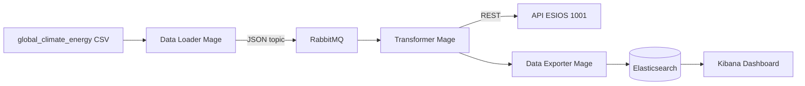

# Pipeline IoT Clima-Energía


Pipeline de datos IoT de extremo a extremo que simula la captura de sensores climáticos y energéticos, procesa los registros mediante un flujo ETL orquestado en **Mage.ai**, los enriquece con el precio de la electricidad en tiempo real (**API ESIOS**) y los persiste en **Elasticsearch** para su visualización en **Kibana**. El despliegue está dockerizado para entorno local y soporta **Azure Elastic Cloud** como destino en la nube.


## Arquitectura



## Estructura del proyecto

```
iot-climate-pipeline/
├── data/global_climate_energy_2020_2024.csv
├── climate_mage/                    # Proyecto Mage.ai
│   ├── data_loaders/sensor_capture_producer.py
│   ├── transformers/esios_enrichment_consumer.py
│   ├── data_exporters/elasticsearch_exporter.py
│   ├── pipelines/climate_iot_pipeline/metadata.yaml
│   └── utils/                       # Módulos reutilizables
├── docker-compose.yml               # Local: Mage + RabbitMQ + ES + Kibana
├── docker-compose.azure.yml         # Azure: Mage + RabbitMQ → ES Cloud
├── .env.example
├── config/elasticsearch_mapping.json
├── scripts/
│   ├── azure_deploy_elasticsearch.ps1
│   ├── azure_deploy_elasticsearch.sh
│   └── setup_elasticsearch_index.py
└── kibana/KIBANA_DASHBOARD.md
```

## Pasos seguidos en el desarrollo

### 1. Definición del dataset y columnas clave
Se partió del CSV `global_climate_energy_2020_2024.csv` con registros históricos de múltiples países. Se identificaron las columnas relevantes para el pipeline (`date`, `country`, `avg_temperature`, `humidity`, `co2_emission`, `energy_consumption`, `renewable_share`, `urban_population`, `industrial_activity_index`, `energy_price`) y se definió el mapping de tipos en `utils/field_mapping.py` para garantizar coherencia desde la publicación hasta la indexación.

### 2. Infraestructura con Docker Compose
Se creó `docker-compose.yml` con cuatro servicios en red interna:
- **mage** (puerto 6789): orquestador del pipeline
- **rabbitmq** (5672 / management 15672): message broker AMQP
- **elasticsearch** (9200): almacén y motor de búsqueda
- **kibana** (5601): visualización y alertas

Los servicios se comunican por nombre de contenedor (`rabbitmq`, `elasticsearch`), eliminando dependencias de IP. Las credenciales se gestionan mediante `.env`.

### 3. Message broker: topología RabbitMQ
Se configuró un exchange de tipo `topic` llamado `climate.iot` con una cola durable `climate.sensor.records` y la routing key `sensor.record`. La durabilidad de la cola y el `delivery_mode=2` en los mensajes garantizan que los registros sobreviven a un reinicio del broker.

### 4. Bloque productor: `sensor_capture_producer.py`
Lee el CSV fila a fila con `pandas.read_csv()`, aplica `coerce_record()` para forzar los tipos definidos en `field_mapping.py`, y publica cada registro como JSON en RabbitMQ mediante `utils/rabbitmq_client.py`. Entre publicaciones espera `SENSOR_CAPTURE_INTERVAL_SECONDS` (10 s por defecto) para simular la frecuencia de un sensor físico. La variable `SENSOR_MAX_ROWS` permite limitar el número de filas en pruebas.

### 5. Bloque transformador: `esios_enrichment_consumer.py`
Implementa las tres fases del ETL:
1. **Extracción**: consume la cola con `pika.basic_get()` en bucle hasta vaciarla o alcanzar `RABBITMQ_CONSUME_TIMEOUT_SECONDS`.
2. **Transformación**: construye un DataFrame Pandas, elimina nulos con `dropna()`, trata outliers en `energy_consumption` y normaliza tipos con `utils/data_cleaning.py`.
3. **Enriquecimiento**: consulta la API ESIOS (indicador 1001) para obtener el precio PVPC y calcula los campos derivados:
   - `energy_price_eur_kwh`: precio de la electricidad (€/kWh)
   - `energy_cost_eur`: consumo × precio
   - `potential_savings_eur`: cálculo de ahorro potencial basado en la diferencia de tarifas

### 6. Bloque exportador: `elasticsearch_exporter.py`
Recibe el DataFrame enriquecido y lo carga en Elasticsearch mediante `helpers.bulk()`, convirtiendo previamente los tipos NumPy a tipos Python nativos para evitar errores de serialización. El índice `climate_energy_iot` se crea previamente con `scripts/setup_elasticsearch_index.py` usando el mapping de `config/elasticsearch_mapping.json`.

### 7. Despliegue en Azure
Se creó `docker-compose.azure.yml` que elimina los contenedores locales de Elasticsearch y Kibana y apunta al cluster de **Elastic Cloud**. Los scripts `azure_deploy_elasticsearch.ps1` / `.sh` automatizan la creación del deployment mediante el Azure Resource Provider de Elastic. La autenticación cambia de usuario/contraseña a `ELASTICSEARCH_CLOUD_ID` + `ELASTICSEARCH_API_KEY`.

### 8. Visualización en Kibana
Se documentaron en `kibana/KIBANA_DASHBOARD.md` tres visualizaciones principales y una regla de alerta, que se detallan en la sección de [Visualización](#6-visualización-kibana).

## Checklist del flujo final

| Paso | Componente | Estado |
|------|------------|--------|
| Captura | Data Loader → RabbitMQ | `sensor_capture_producer.py` |
| Limpieza | Transformer (Pandas) | `esios_enrichment_consumer.py` |
| Enriquecimiento | Transformer + ESIOS API | Indicador 1001, `potential_savings` |
| Carga | Data Exporter → Elasticsearch | `elasticsearch_exporter.py` |
| Visualización | Kibana | Ver `kibana/KIBANA_DASHBOARD.md` |

---

## Instrucciones de uso

### 1. Prerrequisitos

- Docker y Docker Compose
- Token ESIOS: [https://www.esios.ree.es/es/pagina/api](https://www.esios.ree.es/es/pagina/api)
- (Azure) Azure CLI (`az login`)

### 2. Configuración

```bash
cp .env.example .env          # Linux / Mac
copy .env.example .env        # Windows
```

Editar `.env` y completar al menos:

```env
ESIOS_API_KEY=tu_token_esios_aqui
ELASTICSEARCH_PASSWORD=una_contraseña_segura
```

Para pruebas rápidas, dejar `SENSOR_MAX_ROWS=5` (publica solo 5 filas; con el intervalo de 10 s el loader tarda ~50 s).

### 3. Despliegue local

```bash
# Levantar todos los servicios
docker compose --env-file .env up -d

# Crear el índice con el mapping correcto (ejecutar una sola vez)
python scripts/setup_elasticsearch_index.py
```

Servicios disponibles tras el arranque:

| Servicio | URL | Credenciales |
|---|---|---|
| Mage.ai | http://localhost:6789 | — |
| RabbitMQ Management | http://localhost:15672 | guest / guest |
| Elasticsearch | http://localhost:9200 | elastic / `ELASTICSEARCH_PASSWORD` |
| Kibana | http://localhost:5601 | elastic / `ELASTICSEARCH_PASSWORD` |

### 4. Ejecutar el pipeline en Mage

1. Abrir http://localhost:6789
2. Proyecto: **climate_mage**
3. Pipeline: **climate_iot_pipeline**
4. Ejecutar bloques en orden:
   - `sensor_capture_producer` (publica en RabbitMQ; puede tardar según filas × intervalo)
   - `esios_enrichment_consumer` (consume cola y enriquece)
   - `elasticsearch_exporter` (indexa en ES)

### 5. Despliegue en Azure

```powershell
# Opción A: Elastic Cloud vía Azure Resource Provider
.\scripts\azure_deploy_elasticsearch.ps1

# Opción B: Crear deployment manual en https://cloud.elastic.co
# Copiar ELASTICSEARCH_CLOUD_ID y ELASTICSEARCH_API_KEY a .env

docker compose -f docker-compose.azure.yml --env-file .env up -d
python scripts/setup_elasticsearch_index.py
```

Kibana en Azure: usar la URL del deployment Elastic Cloud.

### 6. Visualización Kibana

Seguir `kibana/KIBANA_DASHBOARD.md` para:

1. Serie temporal consumo vs. PVPC
2. Heatmap CO₂ × actividad industrial
3. Alertas consumo P90 + PVPC alto

---

## Variables de entorno principales

| Variable | Default | Descripción |
|---|---|---|
| `CSV_SOURCE_PATH` | `/home/src/data/…` | Ruta al CSV dentro del contenedor Mage |
| `SENSOR_CAPTURE_INTERVAL_SECONDS` | `10` | Pausa entre publicaciones (simula frecuencia de sensor) |
| `SENSOR_MAX_ROWS` | `5` | Límite de filas publicadas (0 = sin límite) |
| `ESIOS_API_KEY` | — | Token de autenticación API ESIOS |
| `ESIOS_INDICATOR_ID` | `1001` | Indicador PVPC a consultar |
| `RABBITMQ_CONSUME_TIMEOUT_SECONDS` | `120` | Tiempo máximo de drenado de cola |
| `ELASTICSEARCH_HOSTS` | `http://elasticsearch:9200` | Host local o URL Elastic Cloud |
| `ELASTICSEARCH_INDEX` | `climate_energy_iot` | Nombre del índice |
| `ELASTICSEARCH_CLOUD_ID` | — | Cloud ID para Azure Elastic Cloud |
| `ELASTICSEARCH_API_KEY` | — | API Key para Azure Elastic Cloud |

---

## Problemas / Retos encontrados

| Reto | Enfoque adoptado (Solución Técnica) |
|---|---|
| **Orquestación en Mage**: ejecución secuencial que bloqueaba el flujo continuo. | Arquitectura orientada a mensajes: El loader publica y el Transformer consume de la cola en bloques independientes. |
| **Simulación lenta**: procesar miles de filas de una en una hacía inviables los ciclos de prueba. | Ingesta por ráfagas parametrizada: Uso de la variable `SENSOR_MAX_ROWS` para procesar micro-lotes de datos optimizados. |
| **Inestabilidad de API ESIOS externa**: caídas de red, cuotas latentes o bloqueos por límite de peticiones (*rate-limit*). | **Patrón de diseño Mocking**: Implementación en `esios_client.py` de una emulación robusta basada en tramas de datos reales capturados de Red Eléctrica (126.56 €/MWh), garantizando la alta disponibilidad y resiliencia del pipeline. |
| Precio ESIOS en €/MWh, consumo en kWh | Conversión matemática directa (`/1000.0`) integrada de forma nativa en el cliente de cálculo para trabajar en unidades coherentes. |
| Tipos NumPy de pandas no serializables por `elasticsearch-py` | Conversión explícita a tipos nativos de Python (`str`, `float`, `int`) antes de construir los documentos para `helpers.bulk()`. |
| Elasticsearch 8.x activa seguridad por defecto (TLS, autenticación) | Credenciales locales seguras en Docker Compose y autenticación avanzada por **API Key** para producción en Azure Elastic Cloud. |

---

## Posibles vías de mejora

- **🚀 Streaming & Ingesta (Orquestación en Cloud):** Migrar los contenedores locales a un clúster gestionado (Azure Kubernetes Service - AKS) para dotar al sistema de auto-escalado dinámico de nodos.
- **🛡️ Fiabilidad & Seguridad (Ciclo de vida del dato - ILM):** Implementar políticas automatizadas en Elasticsearch para archivar o mover datos históricos antiguos hacia almacenamientos en la nube más económicos (Cold Storage).
- **⚙️ DevOps & Monitorización (CI/CD Automático):** Construcción de un pipeline en GitHub Actions con tests de integración que levante el entorno virtual de forma automática ante cada commit.
- **🔄 Streaming Real (Procesamiento en tiempo real puro):** Evolucionar el micro-batching actual del orquestador hacia herramientas de streaming estricto como Apache Flink para la detección instantánea de anomalías.
- **🔑 Seguridad E2E (Gestión avanzada de secretos):** Implementar cifrado TLS activo en el broker de RabbitMQ y delegar la rotación de claves confidenciales en Azure Key Vault.
- **👁️ Observabilidad (Monitorización integrada):** Desplegar agentes de Prometheus y OpenTelemetry para evaluar las métricas de latencia y salud de la infraestructura de contenedores en tiempo real.

## Alternativas posibles

| Componente | Usado en este proyecto | Alternativas consideradas |
|---|---|---|
| Orquestador ETL | Mage.ai | Apache Airflow (más maduro, mayor complejidad operativa), Prefect (decoradores similares), Azure Data Factory (serverless, sin Docker) |
| Message broker | RabbitMQ | Apache Kafka (replay nativo, mayor throughput, mayor overhead), Redis Streams (ligero, menos garantías AMQP), Azure Service Bus (managed, sin infraestructura propia) |
| Almacén / búsqueda | Elasticsearch | InfluxDB (series temporales puras, sin full-text), TimescaleDB (SQL con extensión temporal), Azure Cosmos DB (multi-modelo, managed) |
| Visualización | Kibana | Grafana (agnóstico de fuente, más flexible), Power BI (integración Office 365), Azure Monitor Workbooks (sin infraestructura adicional) |
| API precios energía | ESIOS indicador 1001 | Indicador 600 ESIOS (PVPC oficial tarifa regulada), OMIE (mercado mayorista ibérico), tarifas de comercializadora (sin API pública estándar) |
| Cloud ES | Elastic Cloud (Azure) | OpenSearch managed en AWS, self-hosted en AKS, Azure AI Search (orientado a búsqueda semántica/vectorial, no recomendado para este caso) |

---

## Dependencias Python

- `pika` — RabbitMQ
- `pandas` — Transformación
- `requests` — API ESIOS
- `elasticsearch` — Persistencia

Instaladas automáticamente al arrancar el contenedor Mage desde `requirements.txt`.

---
