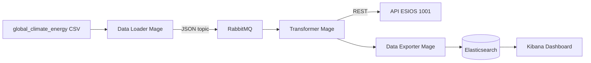

# Pipeline IoT Clima-Energía

Simulación de captura de sensores en tiempo real, procesamiento ETL con **Mage.ai** y **RabbitMQ**, enriquecimiento con la API **ESIOS** (PVPC, indicador 1001) y persistencia en **Elasticsearch** (local o Azure) con visualización en **Kibana**.

## Arquitectura



## Estructura del proyecto

```
iot-climate-pipeline/
├── data/global_climate_energy_2020_2024.csv
├── climate_mage/                    # Proyecto Mage.ai
│   ├── data_loaders/sensor_capture_producer.py
│   ├── transformers/esios_enrichment_consumer.py
│   ├── data_exporters/elasticsearch_exporter.py
│   ├── pipelines/climate_iot_pipeline/metadata.yaml
│   └── utils/                       # Módulos reutilizables
├── docker-compose.yml               # Local: Mage + RabbitMQ + ES + Kibana
├── docker-compose.azure.yml         # Azure: Mage + RabbitMQ → ES Cloud
├── .env.example
├── config/elasticsearch_mapping.json
├── scripts/
│   ├── azure_deploy_elasticsearch.ps1
│   ├── azure_deploy_elasticsearch.sh
│   └── setup_elasticsearch_index.py
└── kibana/KIBANA_DASHBOARD.md
```

## Pasos seguidos en el desarrollo

1. **Dataset**: Definición de columnas clave y generación de CSV de ejemplo (`date`, `country`, `avg_temperature`, etc.).
2. **Infraestructura**: `docker-compose.yml` con Mage.ai (6789), RabbitMQ (5672 / management 15672), Elasticsearch y Kibana.
3. **Message broker**: Exchange tipo `topic` (`climate.iot`) con routing key `sensor.record`.
4. **Bloque productor**: Lectura fila a fila con intervalo configurable (10 s por defecto) y publicación JSON con mapping explícito de tipos.
5. **Bloque transformador**: Consumo de cola, limpieza Pandas (nulos + outliers), llamada ESIOS y cálculo de `potential_savings`.
6. **Bloque exportador**: Carga a Elasticsearch con mapping (`date` → date, `energy_consumption` → float).
7. **Azure**: Scripts CLI para Elastic Cloud y compose separado sin ES local.
8. **Kibana**: Documentación de 3 visualizaciones y regla de alertas.

## Checklist del flujo final

| Paso | Componente | Estado |
|------|------------|--------|
| Captura | Data Loader → RabbitMQ | `sensor_capture_producer.py` |
| Limpieza | Transformer (Pandas) | `esios_enrichment_consumer.py` |
| Enriquecimiento | Transformer + ESIOS API | Indicador 1001, `potential_savings` |
| Carga | Data Exporter → Elasticsearch | `elasticsearch_exporter.py` |
| Visualización | Kibana | Ver `kibana/KIBANA_DASHBOARD.md` |

---

## Instrucciones de uso

### 1. Prerrequisitos

- Docker y Docker Compose
- Token ESIOS: [https://www.esios.ree.es/es/pagina/api](https://www.esios.ree.es/es/pagina/api)
- (Azure) Azure CLI (`az login`)

### 2. Configuración

```powershell
cd iot-climate-pipeline
copy .env.example .env
# Editar .env: ESIOS_API_KEY, contraseñas, etc.
```

Para pruebas rápidas, `SENSOR_MAX_ROWS=5` limita filas publicadas (el loader sigue esperando 10 s entre filas).

### 3. Despliegue local

```powershell
docker compose --env-file .env up -d
python scripts/setup_elasticsearch_index.py
```

Servicios:

| Servicio | URL |
|----------|-----|
| Mage.ai | http://localhost:6789 |
| RabbitMQ Management | http://localhost:15672 (guest/guest) |
| Elasticsearch | http://localhost:9200 |
| Kibana | http://localhost:5601 |

### 4. Ejecutar el pipeline en Mage

1. Abrir http://localhost:6789
2. Proyecto: **climate_mage**
3. Pipeline: **climate_iot_pipeline**
4. Ejecutar bloques en orden:
   - `sensor_capture_producer` (publica en RabbitMQ; puede tardar según filas × intervalo)
   - `esios_enrichment_consumer` (consume cola y enriquece)
   - `elasticsearch_exporter` (indexa en ES)

### 5. Despliegue en Azure

```powershell
# Opción A: Elastic Cloud vía Azure Resource Provider
.\scripts\azure_deploy_elasticsearch.ps1

# Opción B: Crear deployment manual en https://cloud.elastic.co
# Copiar ELASTICSEARCH_CLOUD_ID y ELASTICSEARCH_API_KEY a .env

docker compose -f docker-compose.azure.yml --env-file .env up -d
python scripts/setup_elasticsearch_index.py
```

Kibana en Azure: usar la URL del deployment Elastic Cloud.

### 6. Visualización Kibana

Seguir `kibana/KIBANA_DASHBOARD.md` para:

1. Serie temporal consumo vs. PVPC
2. Heatmap CO₂ × actividad industrial
3. Alertas consumo P90 + PVPC alto

---

## Variables de entorno principales

| Variable | Descripción |
|----------|-------------|
| `SENSOR_CAPTURE_INTERVAL_SECONDS` | Intervalo simulación IoT (default: 10) |
| `ESIOS_API_KEY` | Token API Red Eléctrica |
| `ESIOS_INDICATOR_ID` | 1001 (PVPC según especificación) |
| `RABBITMQ_*` | Conexión y topología del broker |
| `ELASTICSEARCH_*` | Host local o Cloud ID + API Key (Azure) |

---

## Posibles vías de mejora

- **Streaming real**: Separar productor y consumidor en procesos/containers independientes con ejecución continua.
- **Indicador ESIOS**: Validar si el proyecto debe usar 600 (PVPC oficial) vs. 1001 (especificación del enunciado).
- **Batching**: Publicar/consumir en lotes para reducir latencia y llamadas API.
- **Idempotencia**: Claves de documento deterministas y upserts en Elasticsearch.
- **Observabilidad**: Métricas Prometheus + trazas OpenTelemetry en Mage.
- **CI/CD**: Pipeline GitHub Actions que levante compose y ejecute tests de integración.
- **Seguridad**: TLS en RabbitMQ, rotación de API keys y secrets en Azure Key Vault.

---

## Problemas y retos encontrados

| Reto | Enfoque adoptado |
|------|------------------|
| Mage ejecuta bloques en secuencia | El loader publica en cola; el transformer drena la cola con timeout |
| Simulación 10 s × muchas filas | Variable `SENSOR_MAX_ROWS` para pruebas |
| API ESIOS requiere token | Manejo try/except; registro continúa sin PVPC si falla |
| Unidades precio (€/MWh vs €/kWh) | Conversión `/1000` en cliente ESIOS |
| Elasticsearch 8.x seguridad | Usuario `elastic` + password en compose local |

---

## Alternativas posibles

| Componente | Alternativa |
|------------|-------------|
| Message broker | Apache Kafka, Redis Streams, Azure Service Bus |
| Orquestación | Apache Airflow, Prefect, Azure Data Factory |
| Almacén | Azure Cosmos DB, TimescaleDB, InfluxDB |
| API precios | OMIE, tarifas comercializadora, indicador 600 ESIOS |
| Cloud ES | Azure AI Search, OpenSearch managed, self-hosted en AKS |
| Visualización | Grafana, Power BI, Azure Monitor workbooks |

---

## Dependencias Python

- `pika` — RabbitMQ
- `pandas` — Transformación
- `requests` — API ESIOS
- `elasticsearch` — Persistencia

Instaladas automáticamente al arrancar el contenedor Mage desde `requirements.txt`.

---

## Licencia

Proyecto educativo / demostración IoT-ETL.
